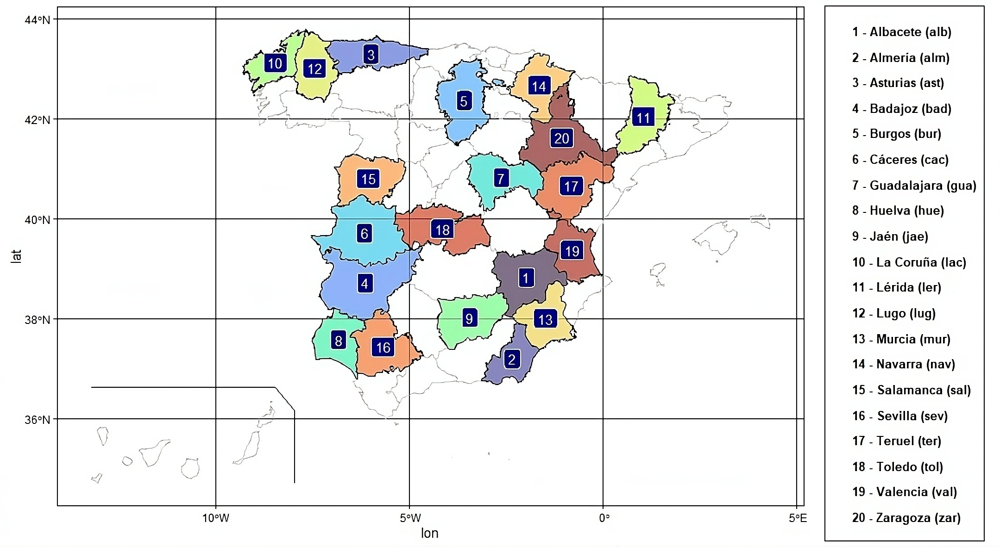

This webpage contains complementary material to the research paper:

  
  A multi-horizon ensemble-based framework for dynamic variable importance analysis in air temperature forecasting.

 

**Contents**

1. [Abstract](#abstract)
2. [Real-world datasets](#datasets)
3. [Variable importance results](#results)

---

## 1. Abstract 

> Forecasting air temperature is crucial for addressing a wide range of environmental challenges, including agricultural yield optimization, water resource management and climate change mitigation. However, existing approaches often overlook the fact that the importance of individual variables can vary substantially across forecasting horizons. This research proposes a novel knowledge-extraction framework for systematically analyzing variable importance in daily average air temperature forecasting across multiple temporal horizons. By leveraging the internal gain information of ensemble-based models, such as gradient boosting trees, this approach extends their proven forecasting capabilities to explore how the relevance of predictive variables shifts as forecasting horizons increase. The proposed methodology is applied to long-term temperature data from 20 different regions in Spain, which are used to define a set of 172 variables, including recent temperatures, historical patterns and calendar-based features. Using these variables, 620 supervised time series datasets are generated incorporating different temporal horizons and the significance of each variable is analyzed through robust statistical validation. The results reveal how the importance of these variables varies across forecasting horizons, providing valuable insights into temperature dynamics and demonstrating the broader applicability of the proposed framework. This finding has implications that extend well beyond temperature prediction, contributing to the field of explainable AI by offering a transferable analytical perspective for any domain where multi-horizon forecasting is required.

---

## 2. Real-world datasets 

This research considers daily climatic data from 20 meteorological stations across different regions in Spain. The data are gathered from the **AEMET** (Agencia Estatal de Meteorología), covering the period of **2008–2023** (16 years). Each dataset contains daily recordings of average temperature (*t*), minimum temperature (*tmin*) and maximum temperature (*tmax*).

From these base datasets, a total of **172 variables** are constructed for each forecasting horizon:

- **93 recent variables** — lagged values of *t*, *tmin* and *tmax* (1 to 31 days back).
- **75 historical variables** — 5-year historical aggregates with multiple lookback windows.
- **4 calendar variables** — day, month, year and day-of-year.

This results in **620 supervised time series** (20 regions × 31 forecast horizons), each evaluated using XGBoost.

  

The original datasets can be obtained from the AEMET open data portal: [https://opendata.aemet.es/](https://opendata.aemet.es/)

Additionally, the processed gain importance results for all 20 stations can be downloaded [here](https://github.com/juanmartinsantos/multi-horizon-framework/raw/main/docs/datasets.zip).

---

## 3. Variable importance results 

<ul class="download-list">
  <li>
    Importance by variable type (Recent / Historical / Calendar)
    
  </li>
  <li>
    Importance by variable subtype (temperature, year, day interval, day, month, yearday)
    
  </li>
  <li>
    Gain importance across all 31 forecasting horizons (averaged over 20 regions)
    
  </li>
</ul>
