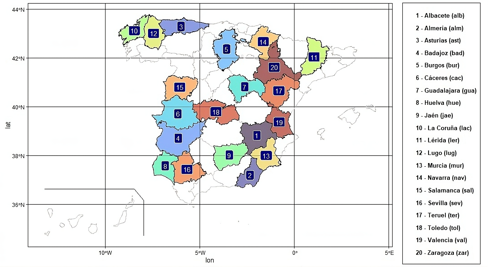

This webpage contains supplementary material for the research paper:

<table><tr>
<td width="140"></td>
<td>Martín, J., &amp; Sáez, J. A. (2026). A knowledge-extraction framework for multi-horizon variable importance analysis in air temperature forecasting <em>[Manuscript submitted to Expert Systems with Applications]</em>.</td>
</tr></table>

 

**Contents**

1. [Abstract](#abstract)
2. [Real-world datasets](#datasets)
3. [Importance results](#results)

---

## 1. Abstract

> Forecasting air temperature is crucial for addressing a wide range of environmental challenges. In this context, understanding the relevance of predictive variables is essential for enhancing model accuracy. However, existing approaches often overlook the fact that feature importance can vary substantially with lead time. Characterizing this evolution is key to capturing temperature dynamics and improving prediction reliability. To address this limitation, a knowledge-extraction framework that leverages gain information from gradient boosting trees is proposed to analyze changes in variable importance. The methodology is applied to long-term temperature data from 20 regions in Spain, from which 172 variables are derived, including recent temperatures, historical patterns and calendar-based features. These are used to generate 620 supervised datasets covering multiple time horizons and the resulting relevance profiles are evaluated through robust statistical analyses. The results reveal clear shifts in variable influence, showing that the factors driving accurate predictions evolve as lead time increases. These findings extend beyond temperature estimation and contribute to explainable AI by providing a transferable analytical methodology for other multi-horizon problems.

---

## 2. Real-world datasets

This research considers daily temperature records collected from 20 locations across Spain over the period 2008–2023. These regions span diverse climate regimes, ranging from semi-arid to Mediterranean conditions. The map below shows the geographical distribution of the study locations.

  

The datasets were obtained from **AEMET**, the Spanish national meteorological agency. Each dataset consists of six variables: daily average temperature (*t*), minimum temperature (*tmin*), maximum temperature (*tmax*) and the calendar features *year*, *month* and *day*. The table below summarizes the main characteristics of the datasets, including the mean and standard deviation of the temperature measurements.

| Data | *t* | *tmin* | *tmax* | Data | *t* | *tmin* | *tmax* |
|---|---|---|---|---|---|---|---|
| `alb` | 15.97 ± 7.71 | 9.55 ± 6.91 | 22.38 ± 8.98 | `ler` | 15.93 ± 7.85 | 9.55 ± 7.05 | 22.30 ± 9.04 |
| `alm` | 19.51 ± 5.57 | 15.38 ± 5.57 | 23.63 ± 5.80 | `lug` | 12.68 ± 5.44 | 7.10 ± 5.18 | 18.26 ± 6.71 |
| `ast` | 13.14 ± 5.10 | 9.03 ± 4.84 | 17.25 ± 5.75 | `mur` | 18.62 ± 6.64 | 12.09 ± 6.22 | 25.16 ± 7.58 |
| `bad` | 17.62 ± 6.94 | 10.48 ± 5.98 | 24.77 ± 8.59 | `nav` | 13.58 ± 6.88 | 7.65 ± 5.83 | 19.52 ± 8.57 |
| `bur` | 12.27 ± 7.26 | 5.07 ± 6.21 | 19.46 ± 9.11 | `sal` | 12.62 ± 6.96 | 5.18 ± 5.90 | 20.06 ± 8.74 |
| `cac` | 16.86 ± 7.31 | 11.06 ± 6.28 | 22.67 ± 8.72 | `sev` | 19.78 ± 6.77 | 13.49 ± 5.94 | 26.06 ± 8.03 |
| `gua` | 11.29 ± 7.15 | 3.66 ± 6.52 | 18.91 ± 8.79 | `ter` | 12.70 ± 7.41 | 5.43 ± 6.67 | 19.97 ± 8.87 |
| `hue` | 18.79 ± 5.83 | 12.85 ± 5.41 | 24.73 ± 6.72 | `tol` | 16.69 ± 7.98 | 10.27 ± 7.13 | 23.10 ± 9.24 |
| `jae` | 17.81 ± 7.59 | 12.83 ± 6.54 | 22.78 ± 8.83 | `val` | 18.92 ± 5.62 | 14.58 ± 5.96 | 23.26 ± 5.64 |
| `lac` | 15.34 ± 3.88 | 12.23 ± 3.74 | 18.44 ± 4.34 | `zar` | 16.45 ± 7.53 | 10.85 ± 6.53 | 22.06 ± 8.84 |

The original datasets can be accessed through the AEMET Open Data portal: [https://opendata.aemet.es/](https://opendata.aemet.es/)

Additionally, the preprocessed datasets used in the experiments can be downloaded [here](https://github.com/juanmartinsantos/multi-horizon-framework/raw/main/docs/input_series.zip). They contain the 20 daily series after imputing the missing values, so every station has the same length (5844 days) and every supervised dataset derived from them has the same size (4002 instances).

---

## 3. Importance results

<ul class="download-list">
  <li>
    Importance of variables by region
    
  </li>
  <li>
    Importance of variable types
    
  </li>
  <li>
    Importance of variable subtypes
    
  </li>
  <li>
    Importance of individual variables
    
  </li>
</ul>
